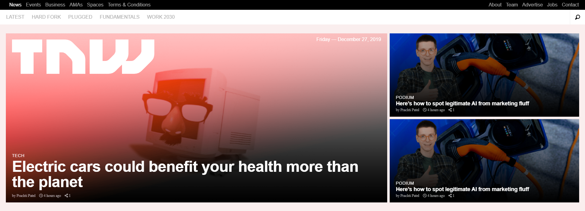

# TNW clone

> A [TNW](https://thenextweb.com/) page clone.

### 1800px 

    

### 960px

    

### 745px

    

This project consisted of building the [TNW](https://thenextweb.com/) webpage using  a self building grid-based [framework](css/framework.css) to make it responsive. The framework's grid system uses rows and columns to layout content, it’s built with float technique and uses media queries to gracefully degrade the page as the window size is reduced. You can see a really good explanation of how the [grid-based framework](https://github.com/fivan18/grid-based-framework) was built [here](https://dev.to/fivan18/how-to-build-a-grid-based-framework-using-the-float-property-2chf).

## Built With

- HTML
- CSS
- Self building grid-base [framework](css/framework.css)

## Live Demo

[https://fivan18.github.io/tnw-clone/](https://fivan18.github.io/tnw-clone/)

## Getting Started

Download this project and use your favorite web brower to open the index.html to see how it looks like.

## Authors

👤 **Ivan Ulises Guzman Sanchez**

- Github: [@fivan18](https://github.com/fivan18)
- Twitter: [@fivanunam](https://twitter.com/fivanunam)
- Linkedin: [fivan](www.linkedin.com/in/fivan)

👤 **Tigpezeghe Rodrige K.**
- Github: [@Trodrige](https://github.com/Trodrige)
- Twitter: [@TRodrige](https://twitter.com/TRodrige)
- Linkedin: [Linkedin](https://www.linkedin.com/in/tigpezeghe-rodrige-k-52472310b/)

## 🤝 Contributing

Contributions, issues and feature requests are welcome!

Feel free to check the [issues page](https://github.com/fivan18/tnw-clone/issues).

